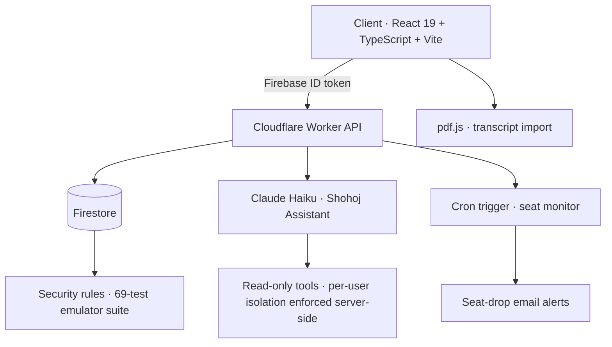

<div align="center"> 
 
<!-- Animated header banner -->


<!-- Typing SVG -->
<a href="https://github.com/souravmondalshuvo">
  
</a>

<br/>

<!-- Status badges -->

&nbsp;

&nbsp;

&nbsp;


<br/><br/>

<!-- NEW: quick navigation -->
<a href="#-featured-project--shohoj-সহজ"></a>
&nbsp;
<a href="#-friday--privacy-first-desktop-ai-assistant"></a>
&nbsp;
<a href="#-the-signal--portfolio-site"></a>
&nbsp;
<a href="#-engineering-highlights"></a>
&nbsp;
<a href="#-connect"></a>

</div>

---

## 👋 About

I'm a Computer Science undergraduate at **BRAC University** focused on building real, usable software. Most of my recent work centers on **Shohoj** — an academic planning platform I built solo, end-to-end, to help BRACU students calculate CGPA, plan semesters, and explore course information more easily.

I care about clean UI, practical problem-solving, maintainable code, and shipping tools that are actually useful beyond assignments.

```javascript
const sourav = {
  role:       "Solo full-stack developer",
  studying:   "BSc in CSE @ BRAC University",
  building:   ["Shohoj — academic planning for BRACU students",
               "FRIDAY — privacy-first desktop AI assistant"],
  toolkit:    ["React", "TypeScript", "Cloudflare Workers", "Firebase", "Python"],
  caresAbout: ["Clean UI", "Maintainable code", "Tools people use"],
  openTo:     ["Internships", "Collaboration", "Open Source"],
};
```

---

## 🚀 Featured Project — Shohoj সহজ

> **A student-focused academic toolkit for BRAC University students. Built solo, end-to-end.**
> 🔗 **[souravmondalshuvo.com](https://souravmondalshuvo.com)** · 🪞 **[Mirror](https://souravmondalshuvo.github.io/Shohoj)**

<div align="center">

<!-- NEW: live CI status — replace ci.yml with your actual workflow filename -->
[](https://github.com/souravmondalshuvo/Shohoj/actions)
&nbsp;

&nbsp;

&nbsp;

&nbsp;


<br/>

<!-- NEW: add a screenshot or GIF at docs/shohoj-preview.png in this repo -->


</div>

| Feature | Detail |
| --- | --- |
| 📚 **Course Catalog** | 857 courses across 16 departments with prerequisite information |
| 🧮 **CGPA Calculator** | BRACU-style grade calculation with retake-aware planning |
| 📅 **Semester Planner** | Credit validation, prerequisite checking, and structured course planning |
| 🔁 **CGPA Playground** | Grade Changer and Reverse Solver for "what-if" academic planning |
| 🎓 **Degree Tracker** | Requirement progress measured against the full degree plan |
| 🎯 **Goal Simulator** | Works backward from a target CGPA to the grades needed to reach it |
| 📈 **GPA Trend Chart** | Semester-over-semester performance visualisation |
| 📄 **Transcript Import** | PDF parsing with transcript-aware extraction |
| 🔐 **Firebase Auth** | Authentication restricted to verified `@g.bracu.ac.bd` accounts |
| ☁️ **Cloud Sync** | Firestore-based academic data syncing |
| 🔔 **Seat-Drop Alerts** | Cron-triggered email notifications when course seats open up |
| 🤖 **Shohoj Assistant** | In-app AI for CGPA modelling, prerequisite checks, and seat lookups |
| 🛡️ **Security Hardening** | Input escaping, safer rendering, CSP/SRI, and Firebase rule hardening |
| ✅ **Testing & CI** | 600+ automated tests across unit, Firestore rules, and E2E layers |

**Stack:** React 19 · TypeScript · Vite · Cloudflare Workers · Firebase Auth · Firestore · Python · Playwright · pdf.js · jsPDF · GitHub Actions

<!-- NEW: architecture diagram — GitHub renders Mermaid natively -->
<details>
<summary><b>🏛️ Architecture at a glance</b></summary>

<br/>



Every request that touches student data passes through a Worker that verifies the Firebase ID token first — the client is never trusted to scope its own reads.

</details>

<details>
<summary><b>🗓️ How Shohoj got here</b></summary>

<br/>

| Stage | What changed |
| --- | --- |
| **Origin** | A single monolithic vanilla JS CGPA calculator |
| **Refactor** | Split into 16 ES modules, bundled to one deployable file via a custom Python build step |
| **Platform** | Firebase Auth + Firestore cloud sync, PDF transcript import/export |
| **Growth** | Catalog expanded 758 → 851 courses; CGPA Playground, Semester Planner, Degree Tracker, Goal Simulator, GPA Trend Chart |
| **Hardening** | XSS escaping, CSP headers, SRI hashes, hand-written Firestore rules with a 69-test emulator suite |
| **Backend** | Cloudflare Workers with token-verified APIs and cron-triggered seat alerts |
| **Now** | React 19 + TypeScript + Vite migration — 15+ components rebuilt from the 65-module codebase, shipping incrementally without downtime |

</details>

---

## 🤖 FRIDAY — Privacy-First Desktop AI Assistant

> **A cross-platform desktop assistant that reads the room without ever storing your face.**

Started as a Telegram bot, now a real Electron application with a JARVIS-style HUD. The interesting part isn't the interface — it's the constraint I designed around: **all sensor processing happens locally, no biometric data is ever persisted, sensing is always visibly indicated, and the attack surface is deliberately minimised.**

<div align="center">


&nbsp;

&nbsp;

&nbsp;


</div>

- 🖥️ **Real Electron shell** running cross-platform (macOS / Windows / Linux), not a browser mockup
- ☁️ **Cloudflare Worker backend** built from scratch to handle everything the client shouldn't
- 🧩 **Skills-registry architecture** — capabilities are added incrementally rather than one monolithic feature set
- 🚨 **Breach-detection HUD state** surfacing what's being attacked and how, in real time
- 🔒 **Privacy as architecture**, not a settings toggle

---

## 🌌 The Signal — Portfolio Site

> **[souravmondalshuvo.com](https://souravmondalshuvo.com)** — built from scratch, no template.

A dark-only portfolio with a **custom GLSL point-field hero** rendered in Three.js. Eight sections spanning both sides of what I do: engineering and music.

<div align="center">


&nbsp;

&nbsp;

&nbsp;


</div>

---

## 💼 Other Projects

| 🏷️ Project | 📄 Description | 🛠️ Stack | 🌐 Live | 📁 Code |
|:---|:---|:---|:---:|:---:|
| **🤖 FRIDAY** | Privacy-first desktop AI assistant with a local-first sensor pipeline and Worker backend |    | — | [📁 Repo](https://github.com/souravmondalshuvo/FRIDAY) |
| **🌌 The Signal** | Portfolio site with a hand-written GLSL point-field hero in Three.js |    | [🌐 Live](https://souravmondalshuvo.com) | — |
| **🍔 Chillox** | Branded restaurant website with responsive sections and an interactive menu |    | — | [📁 Repo](https://github.com/souravmondalshuvo/Restaurant_Website) |
| **🧑‍💻 Portfolio (v1)** | My first portfolio — clean, responsive, built on frontend fundamentals |    | [🌐 Live](https://souravmondalshuvo.github.io/Portfolio) | [📁 Repo](https://github.com/souravmondalshuvo/Portfolio) |

---

## 🛠️ Tech I Work With

<div align="center">

**Comfortable with**


**Learning & growing**


</div>

---

## 📊 GitHub Stats

<div align="center">


</div>

<div align="center">

<!-- host updated: the old herokuapp instance no longer serves since Heroku ended free dynos -->


</div>

<div align="center">


</div>

<!-- NEW: repo cards so people can jump straight into the code -->
<div align="center">

<a href="https://github.com/souravmondalshuvo/Shohoj">
  
</a>
<a href="https://github.com/souravmondalshuvo/FRIDAY">
  
</a>

</div>

---

## 🧩 Engineering Highlights

Behind Shohoj's clean UI is a fair amount of real engineering. A few decisions I'm proud of:

- 🏗️ **Modular architecture** — Refactored a single monolithic script into **16 ES modules**, bundled into one deployable file via a custom Python build step. That codebase has since grown to 65 modules.
- 🔄 **Incremental framework migration** — Currently moving 65 vanilla JS modules to **React 19 + TypeScript + Vite**, 15+ components rebuilt so far, shipping continuously rather than pausing for a rewrite.
- 🌐 **A real backend, not just BaaS** — **Cloudflare Workers** with token-verified APIs and cron triggers sit in front of Firestore, so the client never scopes its own reads.
- 🛡️ **Security audit** — Hardened against XSS with consistent input escaping, added a Content-Security-Policy and Subresource-Integrity hashes, and tightened Firebase access rules.
- 📜 **Security rules treated as code** — Hand-written Firestore rules verified by a **69-test emulator suite**, so access control is proven rather than assumed.
- 🐛 **Hard bug fixes** — Resolved Firestore re-hydration race conditions and a Safari-only Firebase SDK error that only surfaced on real devices.
- ✅ **CI from day one** — What started as a **55-test** suite is now **600+ tests** across unit, Firestore rules, and Playwright E2E layers, running on every push via GitHub Actions.
- 🤖 **AI with server-enforced isolation** — Shohoj Assistant runs on **Claude Haiku** behind a Worker that verifies Firebase ID tokens, exposing read-only tools with per-user data isolation enforced server-side.
- 🐍 **Data pipeline** — A Python LLM pipeline converts unstructured community posts into structured course-review seed data.
- 🔐 **Scoped auth** — Firebase Auth locked to verified BRACU student accounts, with custom session handling and modals.

> *I treat side projects like production software — tests, security, and maintainability included.*

---

## 🎯 Currently Working On

- 🔧 Completing Shohoj's React 19 + TypeScript migration and academic planning flow
- 🤖 Building FRIDAY toward genuinely functional telemetry — real data, not demo state
- 🧪 Expanding test coverage and overall project reliability
- 📈 Strengthening Data Structures & Algorithms with Java
- 📝 Preparing a technical write-up on Shohoj's architecture and testing approach
- 🚀 Sharpening frontend quality, UI polish, and user experience

---

## 🌱 Beyond Code

- 🎤 Ran an IEEE Computer Society seminar as a volunteer at the BRACU chapter — awarded the IEEE CS Seminar Volunteer Certificate
- 💼 Freelance developer and music producer (2020–2023), delivering paid work for international clients
- 🎧 I also write and release music — that side of things lives at [souravmondalshuvo.com](https://souravmondalshuvo.com)

---

## 📫 Connect

<div align="center">

<a href="https://linkedin.com/in/souravmondalshuvo">
  
</a>
<a href="https://souravmondalshuvo.com">
  
</a>

<br/><br/>

<sub>For internships, collaboration, or project discussions, LinkedIn is the fastest way to reach me.</sub>

</div>

---

<div align="center">


<sub><i>Shipping practical software · Learning deeply · Open to internships and collaboration</i></sub>

</div>
